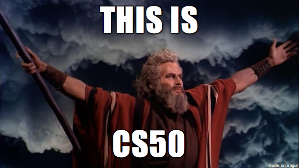

  

O CS50x é uma versão online do curso de introdução à ciência da computação de Harvard. Ele ensina os conceitos fundamentais da programação e da ciência da computação, cobrindo temas como algoritmos, estruturas de dados, desenvolvimento web, segurança, e mais. Ao longo do curso, aprendemos várias tecnologias, incluindo C, Python, SQL, HTML, CSS e JavaScript, por meio de projetos práticos.

## Este repositório
Este repositório foi criado para apresentar os projetos que desenvolvi ao longo do curso, destacando aqueles que considero mais importantes. Nele, compartilho as soluções que implementei e as abordagens que utilizei para resolver os desafios propostos.

---
- [cash.c](#cashc) O inicio
- [substitution.c](https://github.com/dejoao/cs50x/tree/main/Week%202%20-%20Arrays/substitution) Talvez meu favorito
- [runoff.c](https://github.com/dejoao/cs50x/tree/main/Week%203%20-%20Algorithms/runoff) Vote aqui
- [recover.c](https://github.com/dejoao/cs50x/tree/main/Week%204%20-%20Memory/recover) Recuperando
---
## **cash.c**
### Desafio
Suponha que você trabalha em uma loja e um cliente lhe dá $ 1,00 por um doce que custa $ 0,50. Você precisará pagar a ele o troco. Ao dar o troco, é provável que você queira minimizar o número de moedas que está distribuindo para cada cliente, para não ficar sem (ou irritar o cliente!). Implemente um programa em C que imprima as moedas mínimas necessárias para fazer a quantia dada de troco. Moedas de 25, 10, 5 e 1 centavos.

### **Implementação**

[Codigo](https://github.com/dejoao/cs50x/blob/main/Week%201%20-%20C/Problema%2002%20-%20cash/cash.c)

